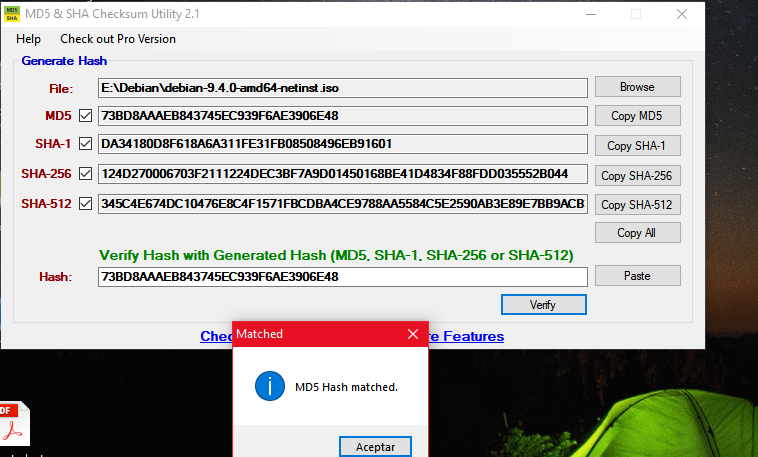

### EXAMEN 1  
**Nombre:** Miguel Andrés Isaza Barona  
**Código:** A00054628  
**Materia:** Sistemas operacionales  
**Correo institucional:** miguel.isaza1@correo.icesi.edu.co  

### 3 Validación de la imagen  
Primero descargamos la imagen debian 9 de https://www.debian.org/distrib/netinst#smallcd seleccionamos amd64, luego de
http://cdimage.debian.org/debian-cd/current/amd64/iso-cd/MD5SUMS consultamos el valor del checksum de la imagen, descargamos un software 
que nos permite comprobar que el checksum de la imagen fuera igual al consultado, esta herramienta se descargó de
http://download.cnet.com/MD5-SHA-Checksum-Utility/3001-2092_4-10911445.html, efectivamente se pudo comprobrar que los checksum son iguales, esto se muestra en la siguiente imagen:
                                              

### 4 Instalación  
Primero abrimos virtualbox, luego de esto damos nueva para cear una nueva máquina, le damos un nombre (en mi caso es Debian9),
seleccionamos el tipo (Linux) y la versión de la máquina virtual (Debian 64 bits).
Luego se configuran los recursos necesarios para la máquina (memoria RAM y disco duro).
Luego nos vamos a configuración, en almacenamiento montamos la imagen, y en la parte de red habilitamos 2 adaptadores (el nat
y el adaptador puente).  
Luego lo iniciamos, le damos graphical install, seleccionamos el idioma, el idioma del teclado, luego creamos un superusuario, le damos un nombre de usuario y una contraseña, a partír de ahí se da continuar para la instalación.  

**Información del SO:**  
                                     

### 5 

### 8 centos7 vs debian9
                 DEBIAN 9                                                                                 CENTOS 7  
     1- Distribución libre, no está basada en ninguna otra destribución.                          Distribución de GNU/Linux derivado.
     2- Versiones de las principales aplicaciones:                                        Versiones de las principales aplicaciones:  
     Apache ->2.2.15                                                                                      Apache -> 2.2.22  
     PHP -> 5.3.3                                                                                         PHP -> 5.4.4  
     MySQL -> 5.1.66                                                                                      MySQL -> 5.5.30  
     PostgreSQL -> 8.4.13                                                                                 PostgreSQL -> 9.1.9  
     3- Ciclo de vida: 10 años, 5½ años actualizaciones, 1 año mantenimiento                        Ciclo de vida: 	Sin ciclos fijos  
        3½ años parches críticos                                                                  1 año tras siguiente versión estable  
     4- Requerimientos minimos: Intel pentium 1-4 celeron, AMD 32,256,500MB y 4GB           Memoria Ram de 64MB, espacio minimo en disco                                                                                               duro de 1GB.  
     5- Arquitecturas: PowerPC, x86 (64 y 32 bits), ARM, SPARC                                                x86_64
        MIPS, 5390.
     6- Facilidad de configuración: Sin costo, sencillo                                        Tiene configuración por defecto
          multiusuario, kernel.                                                                Tiene programas incluidos, incluye
                                                                                                navegadores web y utilidades de oficina.
