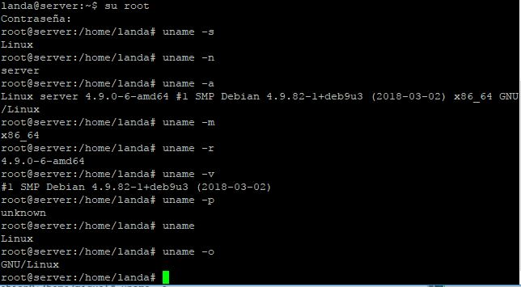
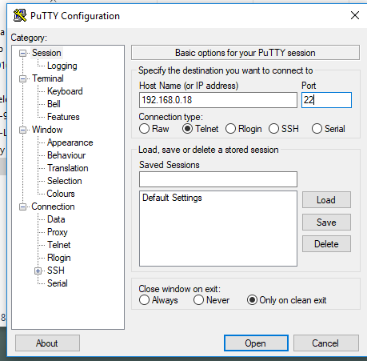
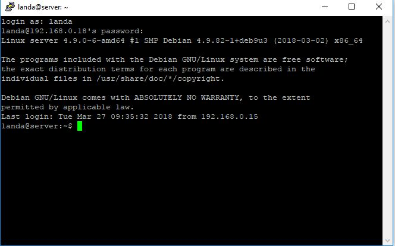
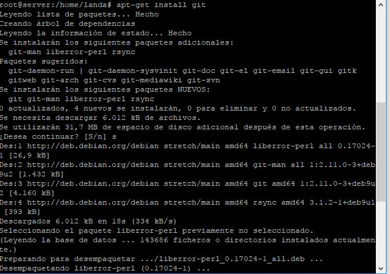
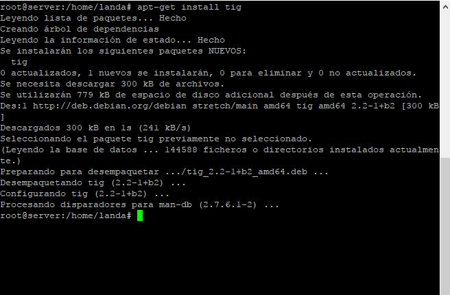
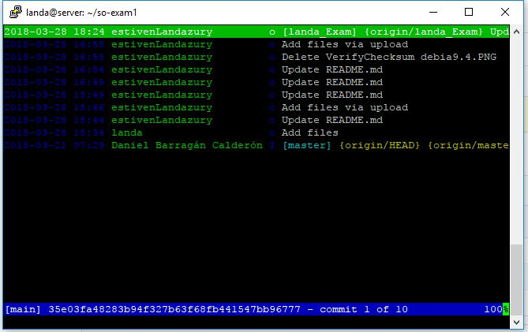

### EXAMEN 1  
**Nombre:** Estiven Landázury   
**Codigo:** A00056992  
**Materia:** Sistemas Operacionales  
**Asunto:** Parcial 1  
**URL repositorio:** https://github.com/estivenLandazury/so-exam1.git  
**URL Repositorio:**  https://github.com/ICESI-Training/so-exam1

### Validación del checkSum  
Primero descargamos la imágen ISO de debian 9 para posteriormente buscar el número del checksum.  
Una vez tuvimos el número del checksum lo veriicamos con la herramienta MD5SUMS para garantizar que la descarga de la ISO fue correcta.  
Esto se puede evidenciar en la siguiente imagen.    
  

### Instalación Devian 9  
Primero descargamos la imagen ISO de debian, proseguimos a subirla a la máquina de virtual box, y realizamos una serie de configuraciones.  Asignamos memoria, procesador y configuraciones de red. Posteriormente procedimos a iniciar la máquina para el proceso de la instalación.  Selecionamos idioma, particionamos la cantidad de disco duro que asignamos anteriormente a la máquina virtual,obteniendo de esta forma dos particiones, una especificamente para el almacenamiento y sistema operativo y la otra como punto de remonte en caso que se desea recuperar el sistema si llegase a fallar. Seguidamente seleccinamos devian como tipo servidor y también elegimos la interfaz gráfica con la que se desea interactua.Al finalizar esta operación se epieza a instalar paquetes necesarios para el funcionamiento del sistema y finalmente acabamos con la instalación. Podemos observar las caracterisitcas del sistema en la siguiente imagen:  
  

### Configuración InterfazPutyy  
Acontinuacón se adjuntan una imágenes donde se evidencian la configuración de la interfaz de la aplicación putty y también el funcionamiento en la máquina virtual:  
  

 

### Instalación git y tig  
La instalación de estos dos servicios es muy sencilla, acontinuación en la imagen se pueden observar los comandos empleados para dicho proposito.  
Aquí podemos observar el comando utilizado para la instalación de git  
  
Aqui podemos observar el comando utilizado para la instalación de tig  
  
Aquí se evidencian los commits realizados utilizando tig  
  

### Debian vs Centos7                                                  
**por qué debian?**  
1.– Por facilidad de mantenimiento  
(el apt-get es el mejor amigo de Debian,  
y Debian no sería Debian sin el apt-get).  

2.– Menor consumo de disco duro (al no   
instalar paquetes que no usaremos jamás,   
se ahorra bastante espacio).  

3.– Más control sobre lo que se configura  
(no dependemos de un script que mañana   
puede cambiar de nombre o de funcionamiento  
o que no funcione como esperaba).  

4.– Por tener paquetes más antiguos pero  
mucho más estables (más testeados y cuyas  
actualizaciones se basan en la misma versión estable).  

5.– Porque no instala un entorno gráfico por   
defecto (¿para qué queremos un sistema gráfico  
en un servidor que no va a tener monitor?   
¿Para consumir RAM y procesador?).  

6.– Para disponer de mucha más documentación   
(Debian es una de las distribuciones más utilizadas   
actualmente, y más en servidores).  

7.– y porque el “modo texto” no es tan difícil  
como parece en un principio.  

8– Como el número de procesos que utiliza    
Debian de base cabe en una pantalla sin scroll,  
el consumo de recursos se reduce hasta un 70%   
(memoria RAM, procesador, disco duro, etc…).  

9– Yum es lento con avaricia (un “yum install  
mc” tarda MÁS incluso que un “apt-get upgrade  
&& apt-get install mc” -que es al fin y al-  
cabo lo que hace-).  

10- Muchas personas utilizan otras distribuciones  
ya que editar un archivo en modo texto es feo  
y complicado (el ‘vi’ no es precisamente un editor  
intuitivo) pero para eso tenemos otros editores  
mucho más amenos y bonitos como el ‘mcedit‘   
(que viene con el paquete ‘mc‘).  

  **Por qué CENTOS?**  
  
1- Al igual que Ubuntu bifurcado de Debian,  
CentOS se basa en el código fuente abierto de   
RHEL (Red Hat Enterprise Linux) y proporciona  
un sistema operativo de nivel empresarial de forma gratuita.  

2- Los lanzamientos de CentOS son mucho menos frecuentes  
que Ubuntu y más esporádicos que Debian.  

3- Todas las versiones principales desde CentOS 5 tienen   
actualizaciones de mantenimiento durante 10 años y actualizaciones  
completas durante (aproximadamente) seis años. Estas actualizaciones  
siguen el ciclo de vida de soporte de Red Hat Enterprise Linux.  

4- Solo se lanzan versiones verdaderamente estables de CentOS,  
que es en parte la razón por la que a veces tardan tanto.  

5- Con una cuota de mercado del 20.4%, la base de usuarios  
de CentOS es más pequeña que la de Ubuntu, y como tal, hay  
menos asistencia de la comunidad y tutoriales en línea disponibles.  

6- La falta de apoyo de la comunidad y una instalación más difícil  
hace que CentOS sea difícil de aprender para los principiantes de Linux.   
En cambio, debido a que está basado en el RHEL de grado empresarial,   
CentOS generalmente es preferido por empresas y agencias web que ya   
están familiarizadas con las distribuciones de Linux.  

7- Esta dirigido a personas que buscan la estabilidad de clase    
empresarial del sistema operativo sin el costo de la certificación y apoyo.  

8- muy propenso a errores.  

9- Independencia Tecnológica(Acceso al codigo fuente).  

10- El formato estandar permite una operavilidad más alta entre sistemas

